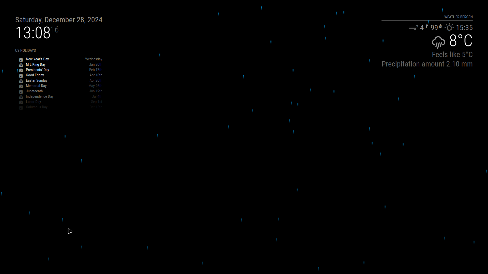
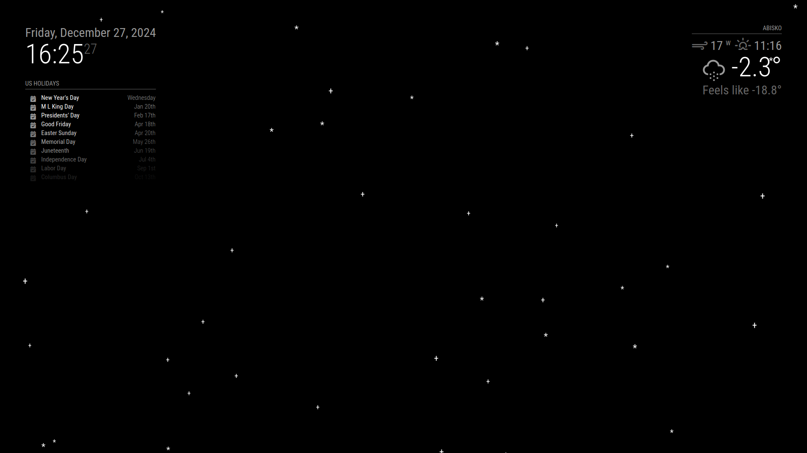
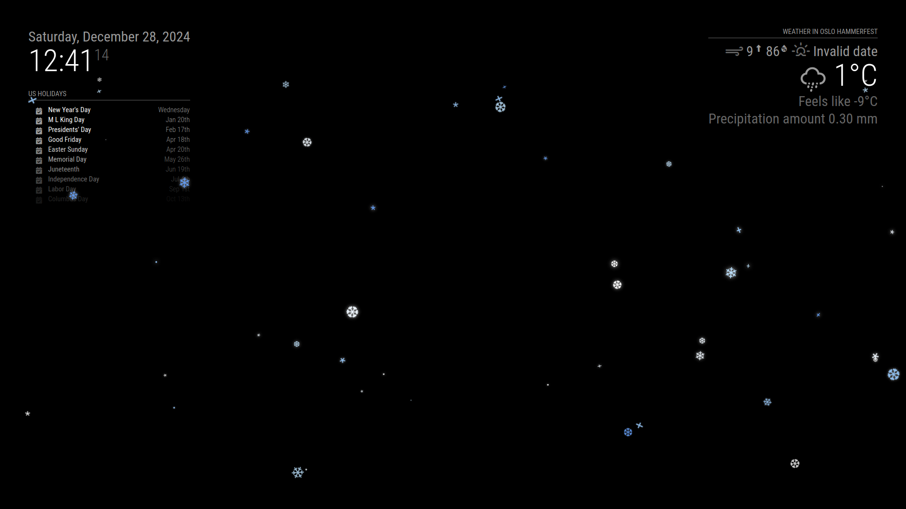

# MMM-WeatherEffects

A MagicMirror² module that adds dynamic weather effects (rain and snow) based on current weather conditions. This module automatically displays appropriate weather effects based on real-time weather conditions.

Version: 1.0.0

## Quick Start

Add this minimal configuration to your `config/config.js` to get started:

```javascript
{
    module: "MMM-WeatherEffects",
    position: "fullscreen_above"  // This position is required
}
```

That's it! The module will work with all default settings. See the Configuration section below for customization options.

## Features
- Automatic weather effect detection and display
- Dynamic rain effects with wind direction support
- Customizable snow effects with multiple styles
- Smooth transitions between weather states
- Performance-optimized animations
- Real-time weather condition monitoring

## Visual Examples

The module supports various weather effects with different styles and intensities:

### Rain Effect

*Rain effect with configurable intensity and wind direction*

### Simple Snow Effect (Light Mode)

*Using simple ASCII characters (`*` and `+`) - ideal for lower-powered devices*

### Decorative Snow Effect (Rich Mode)

*Using snowflake characters (❄) - more visually appealing for powerful devices*

## Installation

### Step 1: Clone the Module
```bash
cd ~/MagicMirror/modules
git clone https://github.com/cgillinger/MMM-WeatherEffects.git
```

### Step 2: Configure Module
After the minimal setup shown in Quick Start, you can customize the module using this full configuration example:

```javascript
{
    module: "MMM-WeatherEffects",
    position: "fullscreen_above",
    config: {
        enabled: true,
        intensity: "auto",
        rainConfig: {
            dropletCount: 50,
            dropletSpeed: 2.0,
            windDirection: "none",
            enableSplashes: false
        },
        snowConfig: {
            flakeCount: 25,
            characters: ['*', '+'],
            sparkleEnabled: false,
            minSize: 0.8,
            maxSize: 1.5,
            speed: 1.0
        }
    }
}
```

## Configuration Options

### General Settings

| Option | Description | Default | Required | Notes |
|--------|-------------|---------|----------|--------|
| `enabled` | Enable/disable module | `true` | No | Master switch |
| `intensity` | Effect intensity | `"auto"` | No | Options: "auto", "light", "medium", "heavy" |
| `transitionDuration` | Effect transition time | `1000` | No | In milliseconds |

### Rain Settings (`rainConfig`)

| Option | Description | Default | Required | Notes |
|--------|-------------|---------|----------|--------|
| `dropletCount` | Number of raindrops | `50` | No | Range: 1-200 |
| `dropletSpeed` | Rain falling speed | `2.0` | No | Range: 0.1-5.0 |
| `windDirection` | Rain angle | `"none"` | No | Options: "none", "left-to-right", "right-to-left" |
| `enableSplashes` | Show splash effects | `false` | No | Visual enhancement |

### Snow Settings (`snowConfig`)

| Option | Description | Default | Required | Notes |
|--------|-------------|---------|----------|--------|
| `flakeCount` | Number of snowflakes | `25` | No | Range: 1-100 |
| `characters` | Snowflake characters | `['*', '+']` | No | Array of characters |
| `sparkleEnabled` | Enable sparkle effect | `false` | No | Visual enhancement |
| `minSize` | Minimum flake size | `0.8` | No | In em units |
| `maxSize` | Maximum flake size | `1.5` | No | In em units |
| `speed` | Snow falling speed | `1.0` | No | Range: 0.1-5.0 |

## CSS Customization

The module comes with default styling that you can customize by modifying the CSS. Here are some common customizations you might want to make:

### Rain Customization
You can modify the rain appearance in your custom CSS:

```css
/* Make rain more visible */
.rain-particle {
    width: 4px;          /* Thickness of raindrops */
    height: 16px;        /* Length of raindrops */
    opacity: 0.8;        /* Transparency (0.0 to 1.0) */
    background: linear-gradient(to bottom, #00aaff, transparent); /* Color of rain */
}

/* Customize rain splash effect */
.rain-splash {
    width: 10px;         /* Size of splash */
    height: 2px;         /* Height of splash */
    background-color: #00aaff; /* Color of splash */
    opacity: 0.5;        /* Splash transparency */
}
```

### Snow Customization
For snow effects, you can adjust:

```css
/* Change snow appearance */
.snow-particle {
    color: white;        /* Default color of snowflakes */
    opacity: 0.8;        /* Transparency (0.0 to 1.0) */
}

/* Color variations for snowflakes */
.snow-particle.blue-light {
    color: #BDE3FF !important;  /* Light blue */
}
.snow-particle.blue-medium {
    color: #99CCFF !important;  /* Medium blue */
}
.snow-particle.blue-dark {
    color: #66A3FF !important;  /* Darker blue */
}
.snow-particle.crystal {
    color: #F0F8FF !important;  /* Almost white */
}

/* Enhance sparkle effect */
.snow-particle.sparkle {
    text-shadow: 0 0 8px rgba(255,255,255,0.8); /* Glow effect */
}
```

### Animation Speed
You can adjust the speed of effects in your CSS:

```css
/* Slow down rain */
.rain-particle {
    animation-duration: 2s !important; /* Higher number = slower */
}

/* Adjust snow fall speed */
.snow-particle {
    animation-duration: 5s !important; /* Higher number = slower */
}
```

To apply these customizations:

1. Create a file named `custom.css` in your MagicMirror's `css` directory
2. Add your desired CSS modifications
3. Restart your MagicMirror

Remember: Small changes can have a big impact on appearance. Start with small adjustments and test each change.

## Performance Recommendations

### For Low-Power Devices (e.g., Raspberry Pi)
```javascript
{
    module: "MMM-WeatherEffects",
    config: {
        rainConfig: {
            dropletCount: 30,
            enableSplashes: false
        },
        snowConfig: {
            flakeCount: 15,
            sparkleEnabled: false,
            maxSize: 1.2
        }
    }
}
```

### For Powerful Devices
```javascript
{
    module: "MMM-WeatherEffects",
    config: {
        rainConfig: {
            dropletCount: 100,
            enableSplashes: true
        },
        snowConfig: {
            flakeCount: 50,
            characters: ['❄', '❆', '*'],
            sparkleEnabled: true,
            maxSize: 2.0
        }
    }
}
```

## Customizing Weather Detection

The module includes a `weatherKeywords.json` file for customizing weather condition triggers. You can modify this to match your weather provider's terminology:

```json
{
    "effects": {
        "rain": [
            "rain",
            "showers",
            "drizzle",
            "precipitation"
        ],
        "snow": [
            "snow",
            "sleet",
            "blizzard",
            "flurries"
        ]
    }
}
```

## Troubleshooting

1. **No effects showing:**
   - Verify your weather module is properly configured
   - Check the weather type notifications in the console
   - Try setting `enabled: true` explicitly
   - Check if weatherKeywords.json matches your weather provider's terms

2. **Performance issues:**
   - Reduce `dropletCount`/`flakeCount`
   - Disable special effects (splashes, sparkle)
   - Use simpler characters for snow
   - Reduce max sizes

3. **Weather detection issues:**
   - Check weather module configuration
   - Verify weather data includes condition types
   - Update weatherKeywords.json with your provider's terms
   - Check console for weather notifications

## Compatibility
- MagicMirror²: >= 2.20.0
- Weather Module: Any that emits weather type notifications
- Browsers: All modern browsers supported

## Contributing
Issues and pull requests are welcome at [GitHub Issues](https://github.com/cgillinger/MMM-WeatherEffects/issues)

## Credits
- Created by Christian Gillinger
- Based on MagicMirror² by Michael Teeuw

## License
MIT Licensed - See LICENSE file for details
